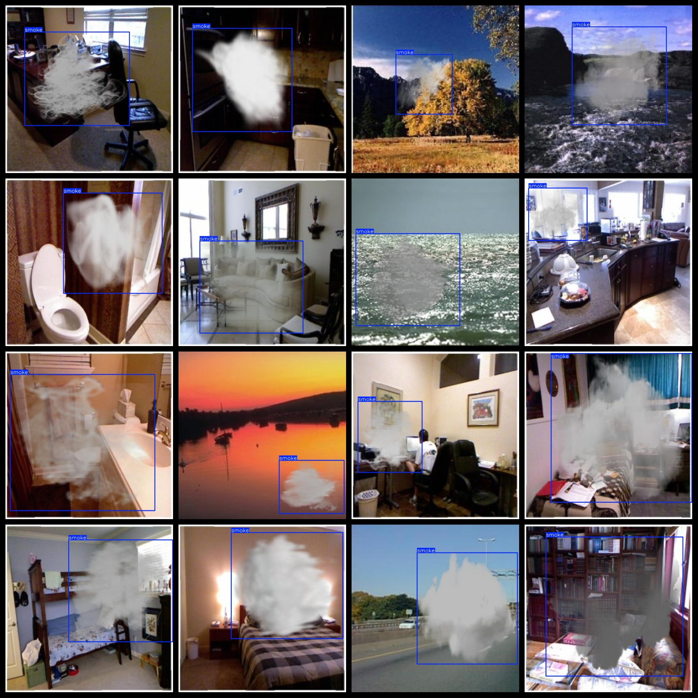

# [Object Detection] Smoke Detection Dataset 21578 imagesYOLO+VOC format

【Object Detection】Smoke Detection Dataset: 21578 YOLO+VOC format

Dataset Format: VOC format + YOLO format

The compressed file contains: three folders, each storing images, xml files, and text files.

Total jpg images in JPEGImages folder: 21578

Total number of XML files in the Annotations folder: 21578

In the 'labels' folder, there are a total of 21578 text files.

Number of tag types: 1

Tag names: ["smoke"]

The number of boxes for each label (Note that the order of labels in the Yolo format does not correspond to this, but is based on the classes.txt file in the labels folder):

smoke frame count = 21578

Total boxes: 21578

Picture clarity (Resolution: Pixels): Clear

Is the image enhanced: No

Shape of the label: Rectangular box, used for object detection and recognition.

Important Note: None

Special Notice: This dataset does not guarantee the accuracy or precision of the trained models or weight files. The dataset only provides accurate and reasonable annotations.

## Images

---

Here is a pay link on Stripe (https://buy.stripe.com/3cs8yP7sY87d0vu9AB). Please contact me lonlonago@foxmail.com after funding $89, and I will send you a complete data files, thank you!

